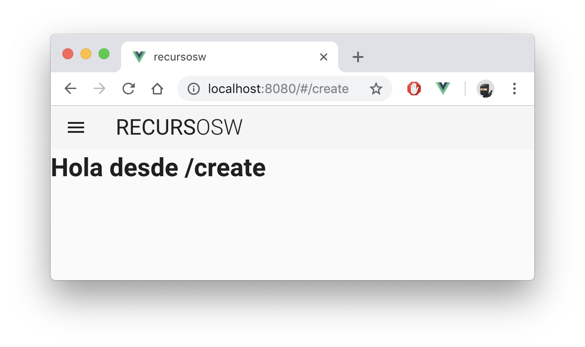

# #2 Router
> 🚦 The official router for Vue.js. http://router.vuejs.org/  

## Empezamos

###### Tareas:
- Crear las vistas en `/views` (Create.vue, About.vue y Resource.vue)
- Agregar las rutas en `router.js`
- Agregar los links al navbar/sidebar en `App.vue`

###### Rutas:
```
  { path: '/', name: 'home', component: 'Home' },
  { path: '/create', name: 'Create', component: 'Create' },
  { path: '/resources/:id', name: 'Resource', component: 'Resource' },
  { path: '/about', name: 'About', component: 'About' }
``` 


> El `template` de las vistas tiene que ser algo sencillo, como esto:

```
<template>
  <div>
    <h1>Hola desde NOMBRE_PAG</h1>
  </div>
</template>
```

> Los links quedarán así:
```
menuItems: [
  { displayName: 'Create', icon: 'add', path: '/create', requireAuth: true },
  { displayName: 'About', icon: 'info', path: '/about' },
  { displayName: 'Resource', icon: 'info', path: '/resources/123' }
]
```




---

Cuando terminemos (o para ver la solución), podemos pasar a la rama `step2.1_router`.
```
git checkout step2.1_router
```

---  


