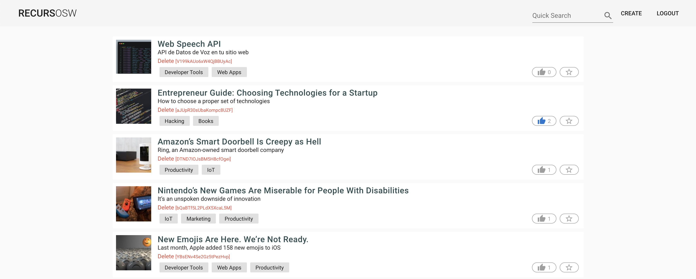
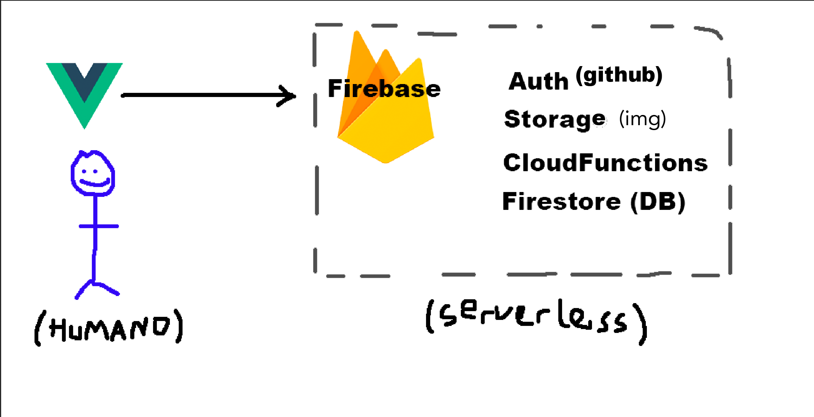

# Taller Vue + Firebase: Learn by doing ✏️
> Construyendo la app de recursOSW en vivo con Jorge Baumann [(@baumannzone)](https://github.com/baumannzone)  
> y Robin Giles [(@robinparadise)](https://github.com/robinparadise) 🦄 

--- 

## Contenidos:
- Vue & Vuex 💚
- Firebase: 
    - Storage 🌉
    - Firestore 📚
    - Authentication 🔒
    - Cloud Functions ⛅️
- Procesamiento de imágenes (Cloud Functions + Storage) 🌐
- Buscador con Algolia / Elasticsearch 🔍
- Open Graph (metadatos) 🔣
- Hosting & Deploy con Netlify ⛓
- Testing (Unit testing, E2E testing) ✅

---

## Requisitos
- Git
- Node v.10 (LTS) + NPM
- Cuenta de Github
- Cuenta de Firebase (Google)

## Recomendaciones
- Editor de texto: [VS Code](https://code.visualstudio.com/), [Sublime Text 3](https://www.sublimetext.com/), [Atom](https://atom.io/), ...
- Sistema Operativo: Linux, Mac
- Navegador web moderno: Google Chrome, Firefox, ...
- Vue Dev Tools: Extensión del navegador ([Chrome](https://chrome.google.com/webstore/detail/vuejs-devtools/nhdogjmejiglipccpnnnanhbledajbpd?hl=es) / [Firefox](https://addons.mozilla.org/es/firefox/addon/vue-js-devtools/)) 
