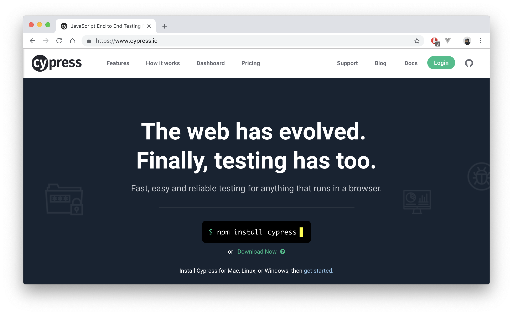
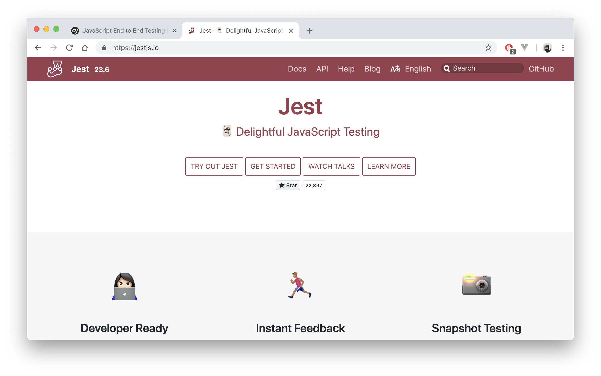
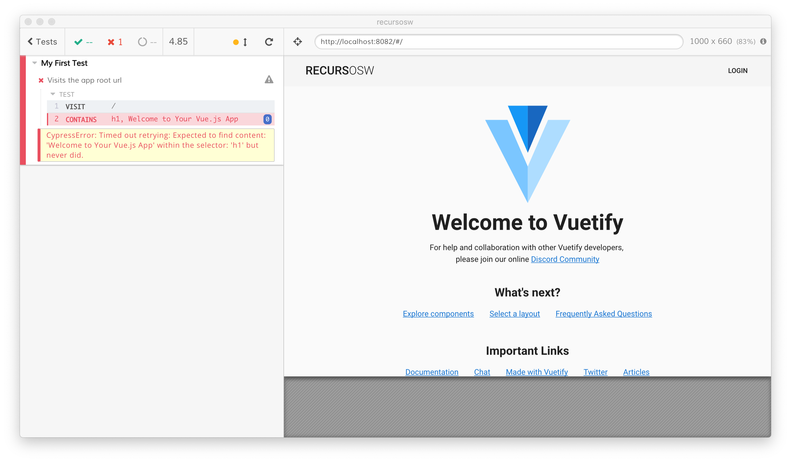

# #7 Testing (Jest & Cypress) 
Testing software. Seguro que conoces varias razones para hacerlo. Estas dos son importantes para nosotros:

> - Nos ayuda a garantizar que no rompemos cosas al realizar cambios
> - _(Por lo tanto)_ Desarrollamos más rapido

## Cypress.io: 
JavaScript End to End (E2E) Testing Framework - https://www.cypress.io/  



## Jest: 
🃏 Delightful JavaScript Testing - https://jestjs.io/  


---
### Empezamos 
Al instalar el proyecto, unas de las opciones que elegimos fue la de testing (Unit y E2E):
```
? Check the features needed for your project:  
  ◉ Babel  
  ◯ TypeScript  
  ◯ Progressive Web App (PWA) Support  
  ◉ Router  
  ◉ Vuex  
  ◉ CSS Pre-processors  
  ◉ Linter / Formatter  
  ◉ Unit Testing  
  ◉ E2E Testing  
```

---
 
Vamos a ver con unos ejemplos básicos que fácil es testear nuestra app

###### Cypress, **tests de integración**.  
Con esta herramienta (que nos encanta 😍) podemos simular el flujo completo de uso de una app en un escenario "real". Es decir, vista de los datos, conexiones con la base de datos, etc,  

Por ejemplo, en nuestro caso podríamos hacer lo siguiente:
- Iniciar sesión
- Navegar por la app  
- Crear un recurso
- Comprobar que el recurso ha sido creado
- Cerrar sesión 

Por defecto, al instalar el proyecto se crean unas funciones de test básicas.  
Podemos ejecutar los test e2e de nuestra app si entramos en la carpeta del proyecto y ejecutamos `npm run test:e2e`.  
- Se nos tiene que abrir una interfaz (luego veremos como hacerlo para que se ejecute más rapidamente, directamente en la terminal ⚡️).
- Si le damos a "▸ Run all specs" se ejecutarán todos (de momento hay 1) los tests.
- Esperamos a que termine y vemos una pantalla como esta:

 
 

---


