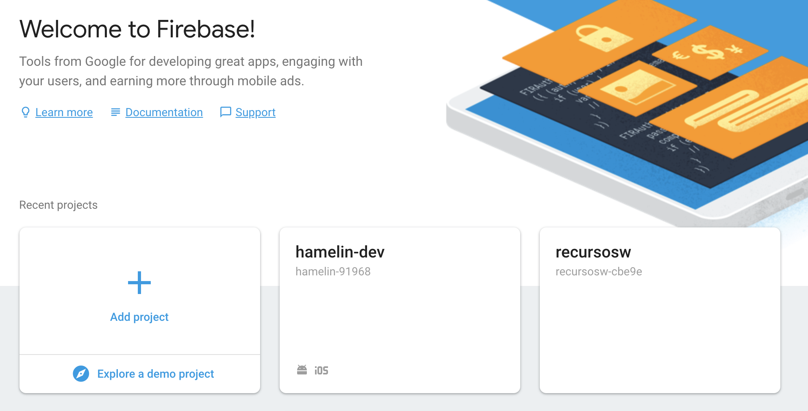
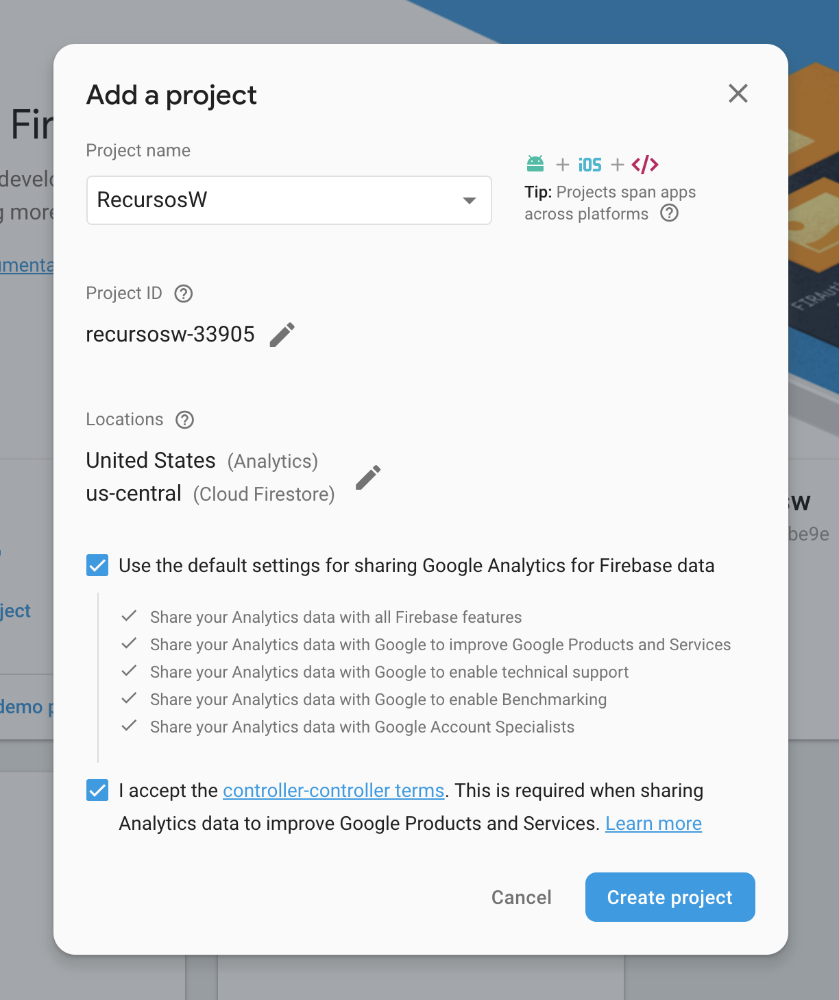
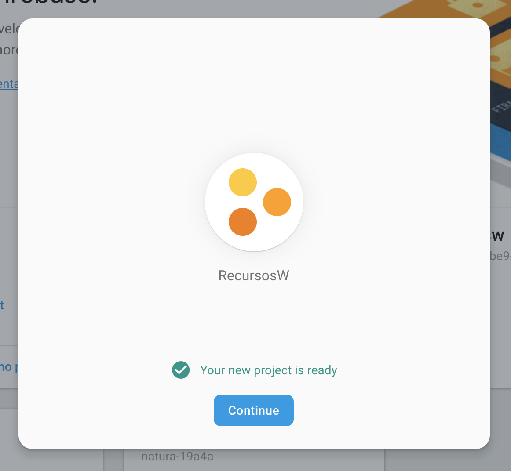
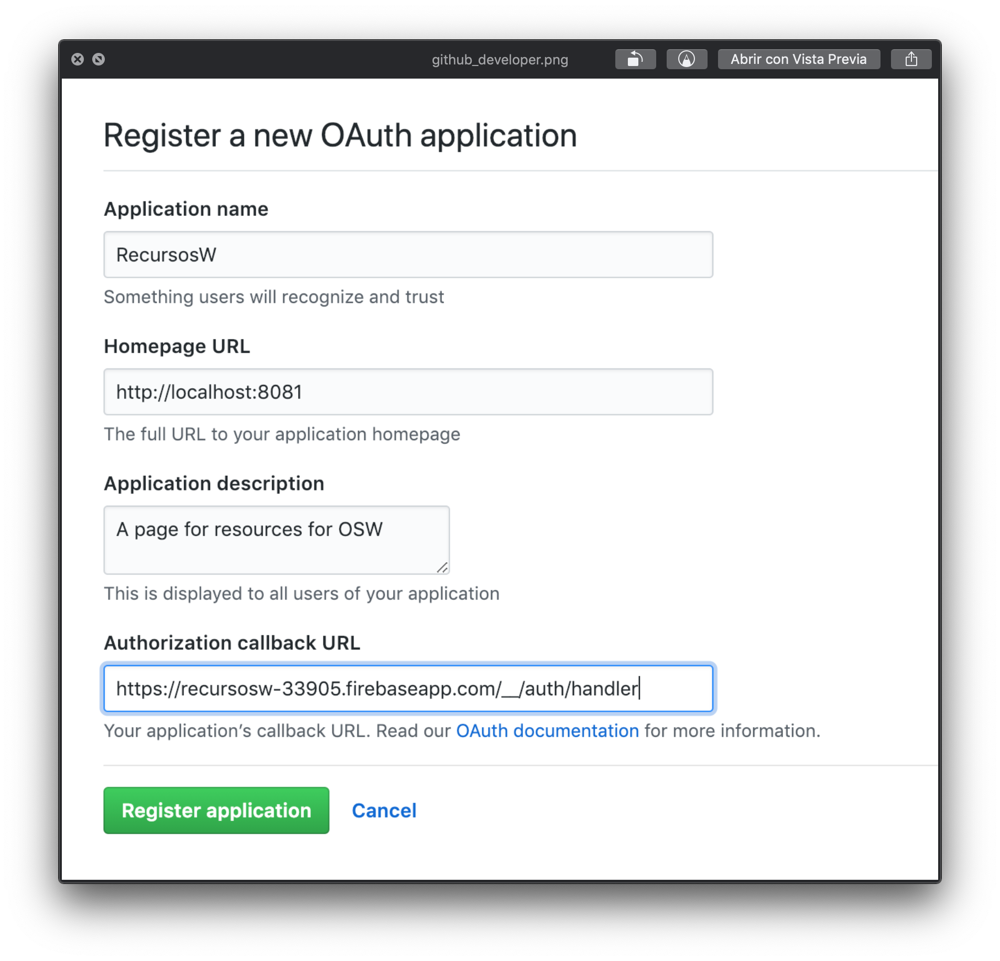
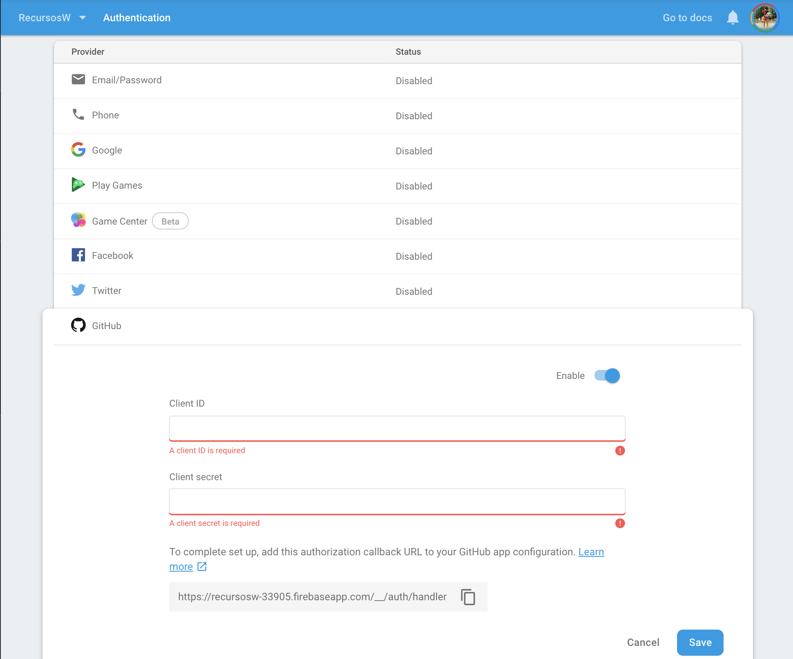
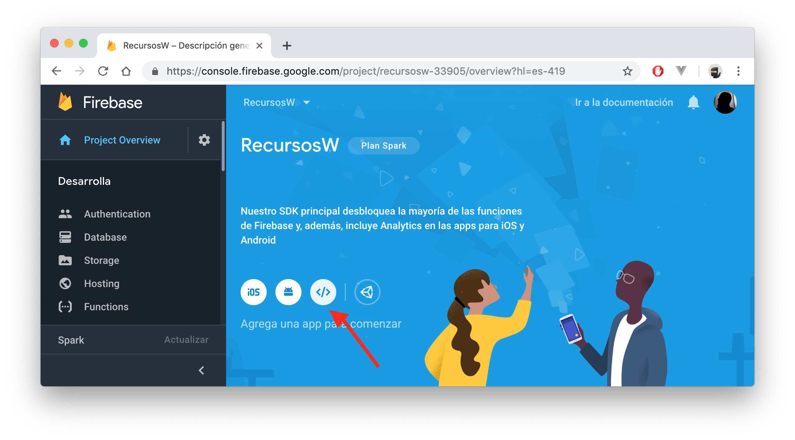

# #3 Firebase Auth + Vuex
> Firebase utiliza la infraestructura de Google y se escala automáticamente con tu aplicación  

**Firebase Authentication** proporciona servicios de backend, SDK fáciles de usar y bibliotecas de IU ya elaboradas para autenticar a los usuarios en tu aplicación.  
Admite la autenticación mediante contraseñas, números de teléfono, proveedores de identidad federados populares, como Google, Facebook y Twitter, y mucho más.

Más info: [Firebase Auth Docs](https://firebase.google.com/docs/auth/?gclid=CjwKCAiA45njBRBwEiwASnZT56aBRLGJrDu6aELp22XPwlXfE6ckFVB6-AlLFoLedkXtlZBp2Vih0xoC4UkQAvD_BwE)

## Empezamos
#### #1
Creamos un proyecto desde la consola de firebase.
Necesitamos tener una cuenta de firebase (google) para ello. 
- Ir a https://firebase.google.com/ y entrar en la consola:

- Creamos un nuevo proyecto, por ejemplo `RecursosW`:

  

- Si todo ha ido bien, veremos la siguiente pantalla:

  

- Dentro de la consola de firebase, vamos a la pestaña de **Authentication**.

- En ella vamos a la pestaña de **Método de acceso** y habilitamos **Github**

- El siguiente paso es crear una _OAuth App_ desde el panel de configuración 
de Github: https://github.com/settings/developers

- Click en el botón 'New OAuth App' y rellenar los datos, similar a la imagen...

  

- Copiamos el *Client ID* y *Client Secret* y, de vuelta a Firebase, lo pegamos en los campos correspondientes

  

- De vuelta al proyecto, editamos el archivo `/src/config/firebase.js` 
y añadimos la configuración del proyecto que acabamos de crear 😉.

  

## Congrats!
👏 😊 🎊 Ya lo has configurado. ¡Es momento de ponerse manos a la obra! 💪 

---

Para continuar, pasamos a la rama `step3.1_auth`

---

