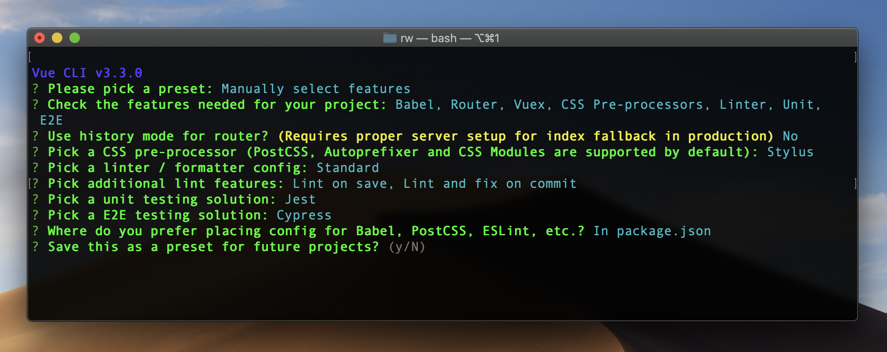
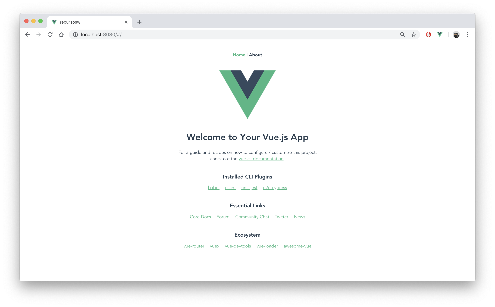

# #0 Vue CLI 

 🛠️ Standard Tooling for Vue.js Development (https://cli.vuejs.org/)


## Empezamos
Seguimos los pasos tal y como se muestra a continuación:

- Clonamos el repositorio y entramos en el proyecto:  
```
git clone git@github.com:baumannzone/recursosw-workshop.git
cd recursosw-workshop 
```

- Vamos a la rama `step0_vue`:
```
git checkout step0_vue
```

- Instalamos Vue CLI (global):
```
npm install -g @vue/cli
# OR
yarn global add @vue/cli
```

- Comprobamos la versión
```
vue -V
# 3.3.0  ó  3.4.0
```

- Creamos un nuevo proyecto:
```
vue create recursosw
```

## Asistente de instalación 
  

```
 ? Please pick a preset: 
   default (babel, eslint) 
 ❯ Manually select features  
```  
  
```
(Marcamos las opciones con el espacio)

? Check the features needed for your project:  
  ◉ Babel  
  ◯ TypeScript  
  ◯ Progressive Web App (PWA) Support  
  ◉ Router  
  ◉ Vuex  
  ◉ CSS Pre-processors  
  ◉ Linter / Formatter  
  ◉ Unit Testing  
  ◉ E2E Testing  
   ```

```
? Use history mode for router? 
(Requires proper server setup for index fallback in production) (Y/n): n
```

```
? Pick a CSS pre-processor (PostCSS, Autoprefixer and CSS Modules are supported by default):   
    Sass/SCSS  
    Less  
  ❯ Stylus  
```

```
? Pick a linter / formatter config: 
    ESLint with error prevention only   
    ESLint + Airbnb config   
  ❯ ESLint + Standard config   
    ESLint + Prettier   
```

```
(Marcamos las opciones con el espacio)

? Pick additional lint features: 
 ◉ Lint on save
 ◉ Lint and fix on commit
```

```
? Pick a unit testing solution: 
  Mocha + Chai 
❯ Jest
```

```
? Pick a E2E testing solution: 
❯ Cypress (Chrome only) 
  Nightwatch (Selenium-based)
```

```
? Where do you prefer placing config for Babel, PostCSS, ESLint, etc.?
  In dedicated config files
❯ In package.json
```

---




---

👌 Si la instalación ha sido correcta, veremos un mensaje como este:
```
🎉  Successfully created project recursosw.
👉  Get started with the following commands
```

## Ejecutando la app
Para ejecutar la app hacemos lo siguiente:

```bash
  $ cd recursosw
  
  $ npm run serve
  # OR 
  $ yarn serve 
```

--- 

## Hello World!
Vista previa de la app  

  
  
---

## Conclusiones

:trollface:
  
   


  
   
