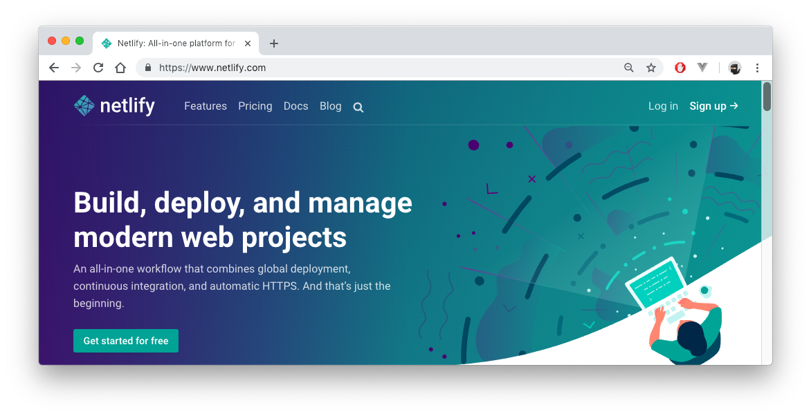
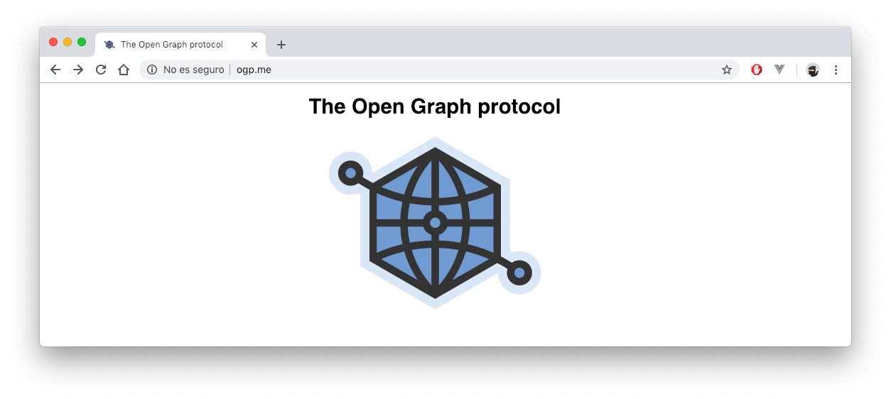
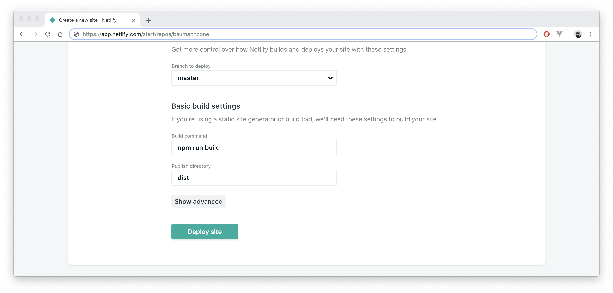

# #4 Hosting & Deploy + Open Graph
> Netlify: Build, deploy, and manage modern web projects  
https://www.netlify.com/

> Open Graph: The Open Graph protocol enables any web page to become a rich object in a social graph.  
http://ogp.me/

---

### Netlify:
- All-in-one platform for automating modern web projects. 😍
- Es como [github-pages](https://pages.github.com/), pero vitaminado 💊
  - Despligue automatico 
  - Vista previa de los cambios antes de hacer el merge a _PRO_ 🔝
  - URL personalizada 
  - Fácil de configurar (la rama, comando para hacer el _build_, etc)
  
###### Vamos a crear un proyecto y a verlo en acción:
- Lo primero es crearse una cuenta y acceder a la plataforma.
- Una vez dentro, le damos a **New site from Git** 
- Nos deja elegir entre github, gitlab o bitbucket. En este caso le damos Github.
- Le damos acceso a la app a nuestros repositorios (Esto solo se hace la primera vez que entremos)
- Elegimos el repositorio que queremos hostear y lo configuramos:

#### ¡Fantástico!
Ya lo tienes. 👏 Espera unos instantes y tu sitio será publicado. Por defecto en una url random.    
Ahora puedes ver el log de despliegues de tu sitio y su correspondiente _commit_ y el estado de dicho despligue (_Published_ ☑ - _Failed_ 🤬) o revisar la configuración y personalizar la URL.   

Es genial, ¿Verdad? 🥰

---

### Open Graph:
Seguro que alguna vez te has preguntado xxx

Con open graph puedes configurar estos parámetros y decirle que datos quieres mostar. 
Por defecto intentará coger algunos. xxx

---

