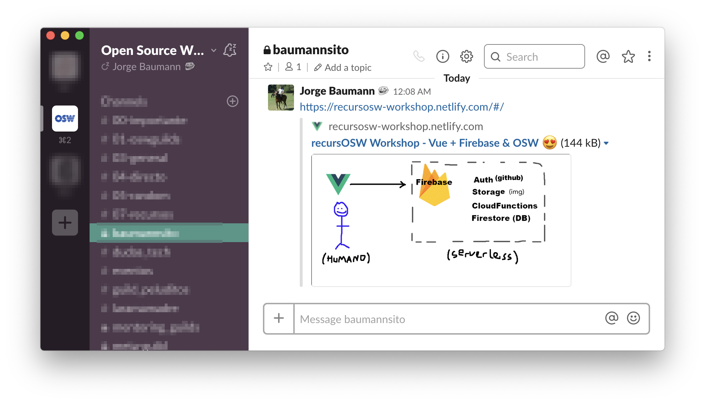

# #4 Hosting & Deploy + Open Graph
> Netlify: Build, deploy, and manage modern web projects  
https://www.netlify.com/

> Open Graph: The Open Graph protocol enables any web page to become a rich object in a social graph.  
http://ogp.me/

---

Acabamos de añadir los metadatos y al compartir en Slack el enlace ya se puede ver el resultado:  

---

Vamos a la rama `step5_firestore`

---

