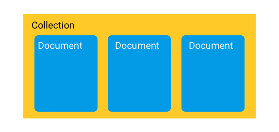
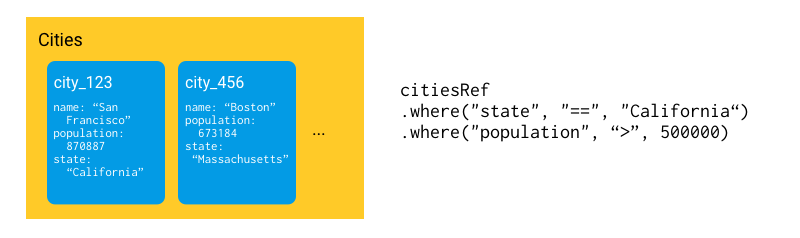
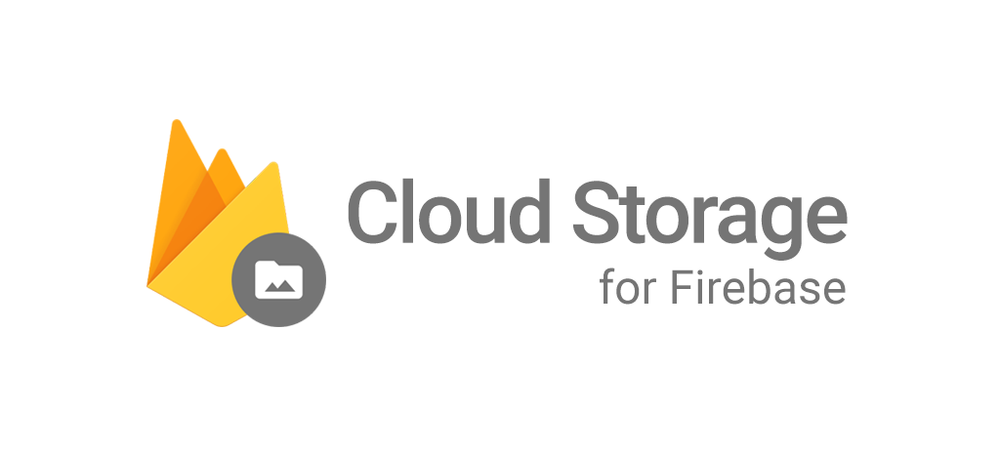

# #5 Cloud Firestore + Cloud Storage

## Cloud Firestore
https://firebase.google.com/docs/firestore/?hl=es-419

> Cloud Firestore es base de datos NoSQL flexible, escalable y en la nube para almacenar y sincronizar datos.  
Se puede usar en el lado del cliente o en el servidor.  
A diferencia de una base de datos SQL, no hay tablas ni filas. En su lugar, almacenas los datos en documentos, que se organizan en colecciones.

 

🔗Explicación: [Firestore](https://firebase.google.com/docs/firestore/data-model?hl=es-419)

## Cloud Storage
https://firebase.google.com/docs/storage/?hl=es-419

> Cloud Storage para Firebase es un servicio de almacenamiento de objetos (imágenes, audio, video, etc) de Google. 
Puedes subir y descargar archivos directamente del cliente.  
Si la conexión a la red es deficiente, el cliente puede reintentar la operación donde la dejó de inmediato, lo cual les ahorra tiempo y ancho de banda a los usuarios.

  

---
Vamos a la rama `step5A_firestore`

---

