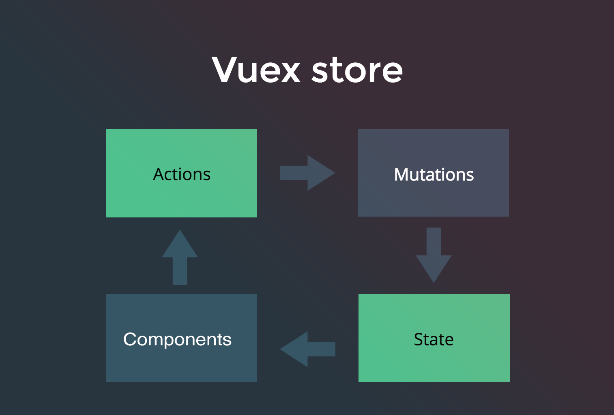

# #3 Firebase Auth + Vuex

¿Cómo vamos? ¿Todo bien? 🤗🤗  

Seguimos trabajando con el Store de nuestra aplicación. En el paso anterior hemos visto y usado las acciones y las mutaciones. Es el momento de usar los `getters`. 

Recordemos lo que vimos en pasos anteriores:

---

Cuando terminemos podemos ir a la rama `step3.4_auth` para ver el resultado final

--- 

