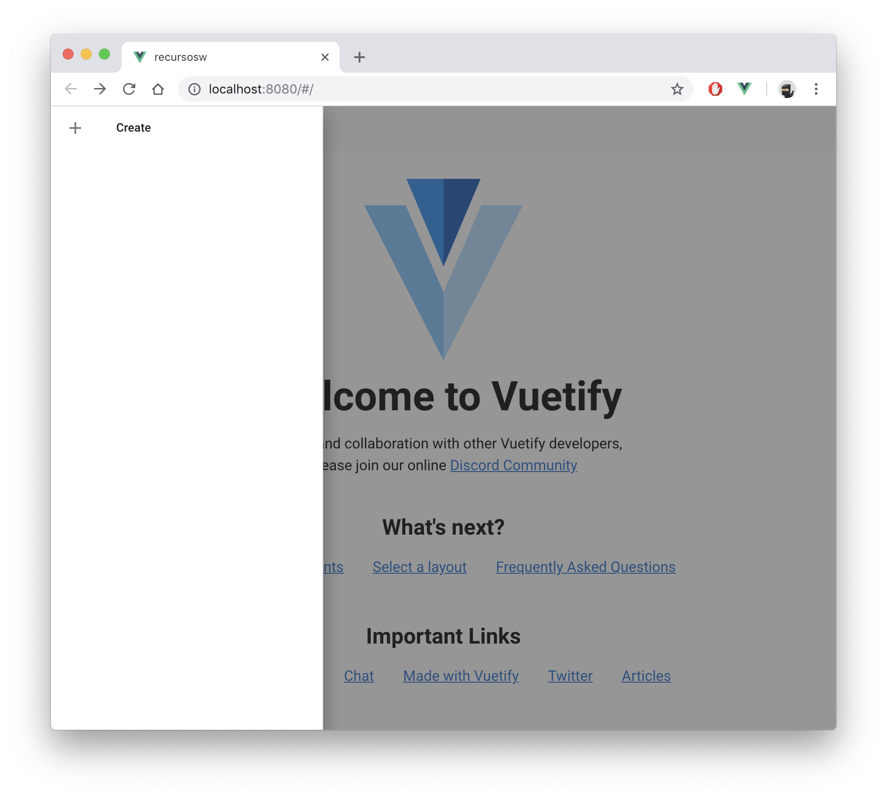

# #1 Vuetify
Material Design Component Framework


## Empezamos
#### #1
- Entramos en la carpeta del proyecto `/recursosw`  
- Agregamos vuetify a nuestro proyecto:  
```
vue add vuetify
```

- Marcamos la opción _Default_ 
```
? Choose a preset: (Use arrow keys)
❯ Default (recommended) 
  Prototype (rapid development) 
  Configure (advanced) 
```

- ✔  Successfully invoked generator for plugin: _vue-cli-plugin-vuetify_

Ya tenemos **Vuetify** instalado en nuestro proyecto.
Levantamos el servidor (`npm run dev`) y vemos que funciona correctamente:


#### #2
Vamos a utilizar los componentes que nos proporciona Vuetify.

- Añadiremos un _sidebar_ ([navigation-drawer](https://vuetifyjs.com/en/components/navigation-drawers)) a nuestra app

- Cambiamos de rama `step1.1_vuetify` para ver el resultado

- Levantamos la app para ver los cambios que se han hecho:  


  

